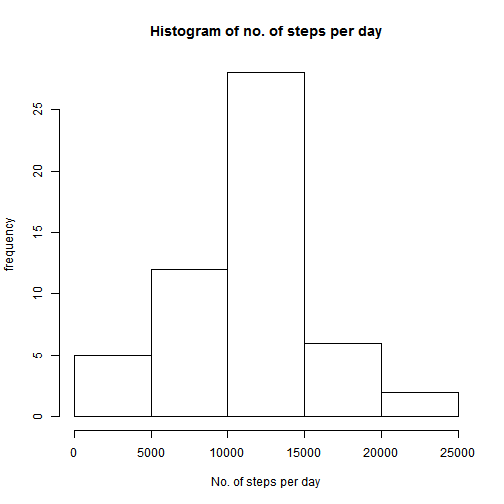
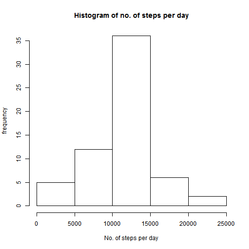

#Reproducible Research Project 1
##By Andy Ng

This rmarkdown file is used to answer the question in project 1
First setup the R envirnoment


###Here we load the data into raw data

```r
  #Load data
  raw_steps_data <- read.csv("activity.csv")
```

###Here we remove the NA and calculate the total steps per day, mean per day, and median per day.

```r
  #Remove NA's
  steps_data <- na.omit(raw_steps_data)
  #SUM data per date
  steps_data <- aggregate(steps_data$steps, by= list(steps_data$date), FUN = sum)
  #Set column names
  colnames(steps_data) <- c("Dates", "Steps")
  #Convert date object
  steps_data[,1] <- as.Date(as.character(steps_data[,1]), format = "%Y-%m-%d")
  #Calculation
  mean_per_day <- mean(as.numeric(steps_data$Steps))
  median_per_day <- median(as.numeric(steps_data$Steps))
  #plotting the no. of steps per day
  hist(steps_data$Steps, xlab = "No. of steps per day", ylab = "frequency", main = "Histogram of no. of steps per day")
```




The mean per day is 10766.1886792453

The mean per day is 10765

###Here we calculate the interval data

```r
  # remove NA's from the data
  interval_steps_data <- na.omit(raw_steps_data)
  # calculate the mean per interval
  interval_steps_data <- aggregate(interval_steps_data$steps, by=list(interval_steps_data$interval), FUN = mean)
  # set the column names
  colnames(interval_steps_data) <- c("Interval", "Steps")
  # plot the data
  plot(interval_steps_data$Interval, interval_steps_data$Steps, xlab = "Interval", ylab = "No. of steps", main = "Number of steps by interval across all days", type = "l")
```


```r
  max_interval_data <- subset(interval_steps_data, Steps == max(interval_steps_data$Steps))
```

The interval that contains the maximum number of steps is 835

###Here we provide a solution for the NA's. We will use the average of that interval across all data to fill in the NA's

The number of NA rows is 2304


```r
  ##Load data
  replaced_data <- raw_steps_data
  ##calculate the mean interval data
  mean_interval_data <- na.omit(raw_steps_data)
  mean_interval_data <- aggregate(mean_interval_data$steps, by = list(mean_interval_data$interval), FUN = mean)
  colnames(mean_interval_data) <- c("Interval", "Steps")
  ##replace the NA's with mean interval data
  replaced_data$steps <- ifelse(is.na(replaced_data$steps), mean_interval_data$Steps[mean_interval_data$Interval %in% replaced_data$interval], replaced_data$steps)
  ## calcuate the sum of data
  replaced_data <- aggregate(replaced_data$steps, by = list(replaced_data$date), FUN = sum)
  colnames(replaced_data) <- c("Date", "Steps")
  ##Convert date object
  replaced_data[,1] <- as.Date(as.character(replaced_data[,1]), format = "%Y-%m-%d")
  ## plot the data
  hist(replaced_data$Steps, xlab = "No. of steps per day", ylab = "frequency", main = "Histogram of no. of steps per day")
```



The mean of the replaced data is 10766.1886792453

The median of the replaced data is 10766.1886792453

In conclusion, after we filled in all the NA's. The mean remains the same and the median has become the same as the mean.

###Here we analysis the difference between weekday and weekend and provide a plot for it


```r
  ##Get raw data
  week_data <- na.omit(raw_steps_data)
  ##Convert date object
  week_data[,2] <- as.Date(as.character(week_data[,2]), format = "%Y-%m-%d")
  ##add a column to determine weekday adn weekend
  week_data[,4] <- ifelse((as.POSIXlt(week_data[,2])$wday == 0 | as.POSIXlt(week_data[,2])$wday == 6), "Weekend", "Weekday")
  ##separate weekday and weekend data
  weekday_data <- week_data[week_data[,4] == "Weekday",]
  weekend_data <- week_data[week_data[,4] == "Weekend",]
  ## calculate the data
  weekday_data <- aggregate(weekday_data$steps, by = list(weekday_data$interval), FUN = mean)
  weekend_data <- aggregate(weekend_data$steps, by = list(weekend_data$interval), FUN = mean)
  colnames(weekday_data) <- c("Interval", "Steps")
  colnames(weekend_data) <- c("Interval", "Steps")
  ##Plot the data
  par(mfrow = c(2,1), mar = c(2,2,2,2))
  plot(weekday_data$Interval, weekday_data$Steps, type = "l", xlab = "Interval", ylab = "No. of steps", main = "Weekday Data")
  plot(weekend_data$Interval, weekend_data$Steps, type = "l", xlab = "Interval", ylab = "No. of steps", main = "Weekend Data")
```


Thanks for reading!!
